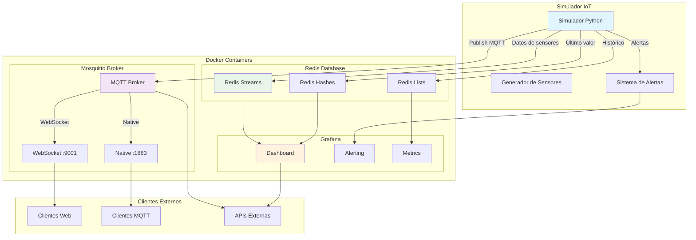
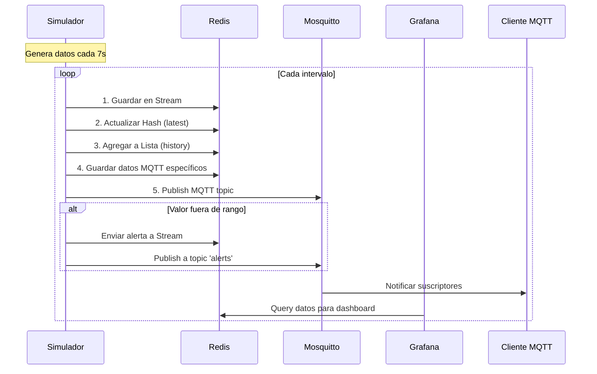
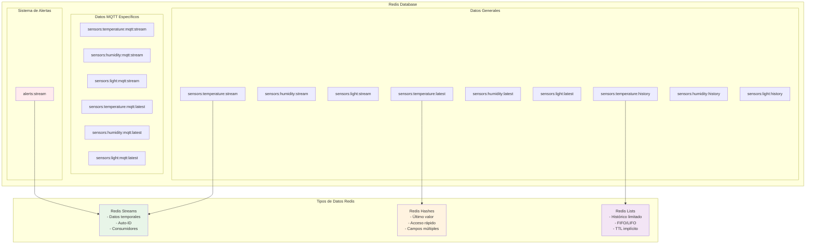
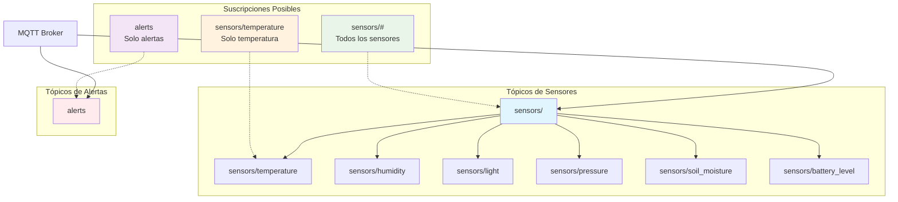

# Explicación Detallada del Simulador IoT con MQTT

## Introducción

Este proyecto implementa un **simulador avanzado de sensores IoT** que integra múltiples protocolos de comunicación y tecnologías para crear un ecosistema completo de Internet de las Cosas (IoT). La evolución respecto al simulador básico incluye el protocolo **MQTT (Message Queuing Telemetry Transport)**, contenedorización con **Docker**, y un broker de mensajes **Mosquitto**.

## Arquitectura del Sistema

### Diagrama General de Arquitectura



### Flujo de Datos Multi-Protocolo



## Análisis de Componentes

### 1. Estructura del Proyecto

#### Archivos del Simulador (`/simulators`)

-   **`app.py`**: Simulador principal con soporte MQTT y Redis
-   **`requirements.txt`**: Dependencias del proyecto

#### Configuración MQTT (`/mosquitto`)

-   **`mosquitto.conf`**: Configuración del broker MQTT
-   **`config/`**: Directorio de configuraciones

#### Orquestación (`docker-compose-mqtt.yml`)

-   **Servicios**: Redis, Grafana, Mosquitto
-   **Volúmenes persistentes**: Para datos y configuraciones
-   **Networking**: Comunicación entre contenedores

## Análisis Detallado del Código

### 1. Importaciones y Dependencias Ampliadas

```python
import redis
import json
import time
import random
import math
from datetime import datetime
import paho.mqtt.client as mqtt
```

**Nuevas dependencias:**

-   **`paho.mqtt.client`**: Cliente MQTT estándar de Python
    -   Protocolo ligero para IoT
    -   Ideal para dispositivos con recursos limitados
    -   Soporta Quality of Service (QoS) y retención de mensajes

### 2. Constructor Mejorado

#### Conexión Dual: Redis + MQTT

```python
def __init__(self):
    # Conexión a Redis
    self.redis_client = redis.Redis(host='localhost', port=6379, decode_responses=True)

    # Configuración de MQTT
    self.mqtt_client = mqtt.Client(protocol=mqtt.MQTTv311, userdata=None, transport="tcp")
    self.mqtt_client.on_connect = self.on_mqtt_connect
    self.mqtt_client.on_disconnect = self.on_mqtt_disconnect
```

**Decisiones de diseño:**

1. **Protocolo MQTTv3.1.1**: Versión estable y ampliamente soportada
2. **Callbacks**: Manejo asíncrono de eventos de conexión
3. **Transport TCP**: Protocolo confiable para comunicación local

#### Inicialización de MQTT con Manejo de Errores

```python
try:
    self.mqtt_client.connect("localhost", 1883, 60)
    self.mqtt_client.loop_start()
    print(" Conectado a MQTT broker en localhost:1883")
except Exception as e:
    print(f" Error al conectar con MQTT broker: {e}")
```

**Características importantes:**

-   **Puerto 1883**: Puerto estándar de MQTT (no encriptado)
-   **Keep-alive 60s**: Tiempo máximo sin comunicación antes de considerar desconexión
-   **loop_start()**: Inicia hilo en background para mantener conexión
-   **Manejo de excepciones**: Graceful degradation si MQTT no está disponible

### 3. Callbacks de MQTT

#### Callback de Conexión

```python
def on_mqtt_connect(self, client, userdata, flags, rc):
    if rc == 0:
        print("Conexión MQTT establecida")
    else:
        print(f"Error en conexión MQTT, código: {rc}")
```


#### Callback de Desconexión con Reconexión

```python
def on_mqtt_disconnect(self, client, userdata, rc):
    print(f"Desconectado de MQTT broker con código: {rc}")
    if rc != 0:
        print("Intentando reconectar a MQTT...")
        try:
            self.mqtt_client.reconnect()
        except:
            print("Reconexión fallida, reintentando más tarde")
```

**Manejo de resiliencia:**

-   **rc != 0**: Desconexión inesperada
-   **Reconexión automática**: Intenta restablecer la conexión
-   **Failover**: Continúa funcionando aunque MQTT falle

### 4. Envío de Datos Dual: Redis + MQTT

#### Estructura de Datos Ampliada

```python
# Datos base para Redis
sensor_data = {
    'timestamp': current_time,
    'sensor_id': f'sensor_{sensor_type}_001',
    'sensor_type': sensor_type,
    'value': value,
    'unit': self.sensors[sensor_type]['unit'],
    'device_id': 'device_001',
    'location': 'India_02'
}

# Datos específicos para MQTT
mqtt_data = dict(sensor_data)
mqtt_data['protocol'] = 'mqtt'
```

**¿Por qué estructuras separadas?**

1. **Trazabilidad**: Identificar origen del dato (Redis directo vs MQTT)
2. **Debugging**: Facilita diagnóstico de problemas de comunicación
3. **Análisis**: Permite comparar rendimiento entre protocolos

#### Almacenamiento Multi-Protocolo

```python
# 1. Stream para datos en tiempo real (Redis - General)
stream_key = f'sensors:{sensor_type}:stream'
self.redis_client.xadd(stream_key, sensor_data)

# 2. Hash para último valor (Redis - General)
hash_key = f'sensors:{sensor_type}:latest'
self.redis_client.hset(hash_key, mapping=sensor_data)

# 3. Lista con TTL para histórico reciente (Redis - General)
list_key = f'sensors:{sensor_type}:history'
self.redis_client.lpush(list_key, json.dumps(sensor_data))
self.redis_client.ltrim(list_key, 0, 999)

# 4. Almacenar datos específicos de MQTT
mqtt_stream_key = f'sensors:{sensor_type}:mqtt:stream'
mqtt_latest_key = f'sensors:{sensor_type}:mqtt:latest'
self.redis_client.xadd(mqtt_stream_key, mqtt_data)
self.redis_client.hset(mqtt_latest_key, mapping=mqtt_data)

# 5. Publicar en MQTT
mqtt_topic = f'sensors/{sensor_type}'
self.mqtt_client.publish(mqtt_topic, json.dumps(mqtt_data))
```

**Estrategia de almacenamiento:**

1. **Datos generales**: Para análisis global del sistema
2. **Datos específicos MQTT**: Para análisis del protocolo MQTT
3. **Separación de contextos**: Facilita troubleshooting y análisis comparativo

### Estructura de Datos en Redis



### 5. Tópicos MQTT Estructurados

#### Convención de Naming

```python
mqtt_topic = f'sensors/{sensor_type}'
# Ejemplos:
# sensors/temperature
# sensors/humidity
# sensors/light
```

**Beneficios de esta estructura:**

1. **Jerárquica**: Permite suscripciones específicas o generales
2. **Escalable**: Fácil agregar nuevos niveles (ej: `sensors/location/device/type`)
3. **Filtrable**: Wildcards MQTT (`sensors/+`, `sensors/#`)

#### Jerarquía de Tópicos MQTT



#### Alertas por MQTT

```python
# Enviar alerta a MQTT
self.mqtt_client.publish('alerts', json.dumps(alert_data))
```

**Tópico de alertas centralizado:**

-   **`alerts`**: Canal dedicado para notificaciones críticas
-   **Separación de responsabilidades**: Datos vs alertas
-   **Facilita integración**: Sistemas de notificación pueden suscribirse solo a alertas

### 6. Monitoreo Mejorado

#### Dashboard de Consola Dual

```python
print(f"[{current_time}] 🌡️ {temp}°C | 💧 {humidity}% | ☀️ {light}lux")
print(f"[{current_time}] 📡 Temp MQTT: {temp_mqtt}°C")
```

**Información mostrada:**

1. **Datos generales**: Estado actual del sistema
2. **Datos MQTT específicos**: Confirmación de funcionamiento del protocolo
3. **Timestamps**: Para correlación temporal

### 7. Graceful Shutdown

```python
except KeyboardInterrupt:
    print("\n Simulación detenida")
    self.mqtt_client.loop_stop()
    self.mqtt_client.disconnect()
```

**Limpieza de recursos:**

1. **loop_stop()**: Detiene el hilo de background de MQTT
2. **disconnect()**: Cierra conexión MQTT apropiadamente
3. **Evita zombie connections**: Libera recursos del broker

## Configuración de Mosquitto

### Archivo `mosquitto.conf`

```properties
listener 1883
allow_anonymous true

listener 9001
protocol websockets
allow_anonymous true
```

**Configuraciones explicadas:**

#### Puerto 1883 (MQTT Nativo)

-   **Protocolo**: MQTT sobre TCP
-   **Uso**: Clientes MQTT nativos (como nuestro simulador)
-   **Seguridad**: `allow_anonymous true` permite conexiones sin autenticación

#### Puerto 9001 (WebSockets)

-   **Protocolo**: MQTT sobre WebSockets
-   **Uso**: Clientes web (navegadores, aplicaciones JavaScript)
-   **Ventaja**: Atraviesa firewalls corporativos más fácilmente

**¿Por qué dos puertos?**

1. **Flexibilidad**: Soporta diferentes tipos de clientes
2. **Compatibilidad**: Algunos entornos solo permiten WebSockets
3. **Desarrollo**: Facilita testing desde navegadores

### Seguridad y Consideraciones de Producción

```properties
allow_anonymous true
```

**⚠️ Nota de seguridad:**

-   **Solo para desarrollo**: En producción debe deshabilitarse
-   **Alternativas seguras**:
    -   Autenticación por usuario/contraseña
    -   Certificados TLS/SSL
    -   ACLs (Access Control Lists)

## Docker Compose MQTT

### Servicio Mosquitto

```yaml
mosquitto:
    image: eclipse-mosquitto:2
    container_name: iot_mqtt
    ports:
        - "1883:1883" # MQTT default port
        - "9001:9001" # WebSockets port for MQTTX web version
    volumes:
        - mosquitto_data:/mosquitto/data
        - mosquitto_log:/mosquitto/log
        - ./mosquitto/config:/mosquitto/config
    restart: always
```

**Características del servicio:**

#### Imagen Base

-   **eclipse-mosquitto:2**: Versión oficial y actualizada
-   **Tamaño optimizado**: Imagen Alpine Linux
-   **Estabilidad**: Versión LTS del broker MQTT más popular

#### Mapeo de Puertos

-   **1883→1883**: Protocolo MQTT nativo
-   **9001→9001**: WebSockets para clientes web

#### Volúmenes Persistentes

-   **mosquitto_data**: Datos persistentes del broker
-   **mosquitto_log**: Logs para debugging
-   **config mount**: Configuración desde host

#### Política de Reinicio

-   **restart: always**: Auto-restart en caso de falla
-   **Alta disponibilidad**: Minimiza downtime del broker

### Integración con otros servicios

```yaml
depends_on:
    - redis
```

**Dependencias:**

-   **Redis independiente**: Mosquitto no depende de Redis
-   **Grafana depende de Redis**: Para visualización de datos
-   **Simulador externo**: Se conecta a ambos servicios


## Dependencias del Proyecto

### `requirements.txt` Ampliado

```pip-requirements
blinker==1.9.0      # Señales para Flask
click==8.2.1        # CLI utilities
colorama==0.4.6     # Colores en terminal
Flask==3.1.2        # Framework web (para futuras extensiones)
itsdangerous==2.2.0 # Seguridad para Flask
Jinja2==3.1.6       # Template engine
MarkupSafe==3.0.2   # Seguridad para templates
paho-mqtt==2.1.0    # Cliente MQTT oficial
redis==6.4.0        # Cliente Redis
Werkzeug==3.1.3     # Utilidades WSGI
```

**Nuevas dependencias explicadas:**

#### `paho-mqtt==2.1.0`

-   **Cliente MQTT estándar**: Mantenido por Eclipse Foundation
-   **Características**: QoS, retained messages, will messages
-   **Compatibilidad**: Soporta múltiples versiones de MQTT

#### Dependencias Flask (para extensiones futuras)

-   **Preparación**: Base para API REST o dashboard web
-   **Modular**: Permite agregar interfaz web sin reestructurar
-   **Estándar**: Stack web Python más común

### 1. Monitoreo Multi-Protocolo

**Escenario**: Comparar rendimiento Redis vs MQTT

```python
# Verificar datos en ambos protocolos
redis_temp = self.redis_client.hget('sensors:temperature:latest', 'value')
mqtt_temp = self.redis_client.hget('sensors:temperature:mqtt:latest', 'value')
```

**Métricas posibles**:

-   Latencia de entrega
-   Pérdida de mensajes
-   Throughput por protocolo

### 2. Alertas Multi-Canal

**Escenario**: Sistema crítico necesita redundancia

```python
# Alerta por Redis Stream
self.redis_client.xadd('alerts:stream', alert_data)

# Alerta por MQTT
self.mqtt_client.publish('alerts', json.dumps(alert_data))
```

**Beneficios**:

-   **Redundancia**: Si un canal falla, el otro funciona
-   **Diferentes consumidores**: Algunos prefieren Redis, otros MQTT
-   **Priorización**: Alertas críticas por ambos canales

### 3. Escalabilidad Horizontal

**Escenario**: Múltiples simuladores

```python
# Identificadores únicos
'device_id': 'device_001'
'location': 'India_02'
```

**Extensión**:

-   Múltiples instancias con diferentes `device_id`
-   Diferentes ubicaciones geográficas
-   Load balancing natural a través de MQTT

### 4. Integración con Sistemas Externos

#### Suscriptores MQTT

```bash
# Suscribirse a todos los sensores
mosquitto_sub -h localhost -t "sensors/#"

# Solo temperatura
mosquitto_sub -h localhost -t "sensors/temperature"

# Solo alertas
mosquitto_sub -h localhost -t "alerts"
```

#### Clientes web

```javascript
// Cliente MQTT en navegador
const client = mqtt.connect("ws://localhost:9001");
client.subscribe("sensors/temperature");
```

## Ventajas del Diseño Multi-Protocolo

### 1. **Flexibilidad de Integración**

-   **Redis**: Para sistemas que necesitan persistencia y consultas complejas
-   **MQTT**: Para sistemas distribuidos y en tiempo real
-   **Ambos**: Para máxima compatibilidad

### 2. **Resiliencia**

-   **Failover automático**: Si MQTT falla, Redis continúa
-   **Redundancia de datos**: Información disponible por múltiples vías
-   **Graceful degradation**: Sistema funcional aunque un protocolo falle

### 3. **Observabilidad**

-   **Comparación de protocolos**: Análisis de rendimiento
-   **Debugging**: Múltiples fuentes de datos para diagnóstico
-   **Monitoreo**: Visibilidad completa del flujo de datos

### 4. **Escalabilidad**

-   **Horizontal**: Múltiples brokers MQTT
-   **Vertical**: Redis Cluster para grandes volúmenes
-   **Híbrida**: Combinación de ambas estrategias