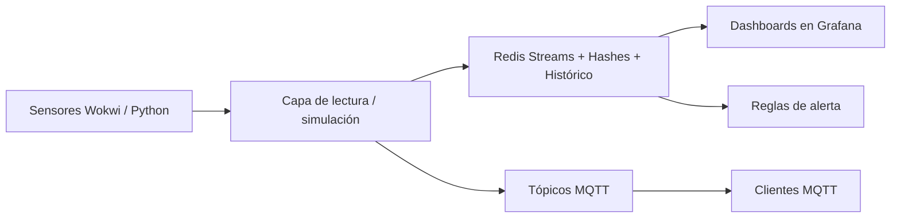

# grafana-sensor-demo

[](1S-2026/grafana)
[](1S-2026)
[](1S-2026/mosquitto)
[](2S-2025/simulators)

Este repositorio agrupa dos ediciones del proyecto con la misma idea central:

**simular sensores -> procesar/publicar datos -> almacenar telemetría -> visualizar y alertar**

## Vista rápida

| Módulo | Qué aporta |
|---|---|
| Simulación de sensores | Dispositivos virtuales en Wokwi y generadores en Python |
| Pipeline de datos | Parsing serial, escritura en Redis y publicacion MQTT |
| Observabilidad | Dashboards en Grafana, tendencias y alertas |
| Valor didáctico | Comparación de protocolos y entendimiento de arquitectura |

## Flujo visual



## Mapa del repositorio

| Ruta | Perfil | Uso ideal |
|---|---|---|
| [1S-2026](1S-2026) | Versión lista para conferencia | Demo end-to-end con provisioning y alertas |
| [2S-2025](2S-2025) | Versión base/fundacional | Laboratorio de aprendizaje enfocado en protocolos |

## Qué incluye cada edición

Ambas ediciones incluyen estos componentes principales:

- Variantes de Docker Compose: simple y completa (con MQTT).
- Dashboards de Grafana listos para importar o auto-provisionar.
- Configuración de Mosquitto para pruebas publish/subscribe.
- Scripts en Python para generar o ingerir datos de sensores.

Diferencias:

- [1S-2026](1S-2026) está optimizada para calidad de presentación y solidez operativa.
- [2S-2025](2S-2025) está optimizada para claridad didáctica y comparación de protocolos.

## Inicio rápido

Primero, elige una carpeta:

```bash
cd 1S-2026
# o
cd 2S-2025
```

Levanta los contenedores:

```bash
docker-compose -f docker-compose-simple.yml up -d
# o
docker-compose -f docker-compose-mqtt.yml up -d
```

Ejecuta el simulador/lector local desde esa misma carpeta y abre Grafana en:

- http://localhost:3000

## Ruta sugerida de exploración

1. Empieza por [2S-2025](2S-2025) para entender la interacción entre Redis, HTTP y MQTT.
2. Pasa a [1S-2026](1S-2026) para una narrativa más pulida orientada a conferencia.
3. Reutiliza dashboards y scripts según el objetivo de tu clase o demo.

## Por qué este repo es útil

Es un puente práctico entre la generación de datos IoT y las prácticas de observabilidad. En lugar de scripts aislados, muestra un pipeline completo donde la telemetría se puede inspeccionar, comparar entre protocolos y transformar en información operativa mediante dashboards y alertas.